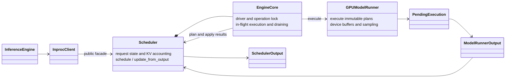

# Inference Engine Internals

Inference uses three one-way **in-process** layers. The colocated rollout
backend shares the trainer's model object, so `EngineCore` is a driver,
not a process or an RPC server.

```text
astrai/inference/
  contracts.py  immutable scheduling and execution data
  frontend/     engine facade, input/output processing, tracking, core client
  core/         EngineCore driver, Scheduler, request lifecycle, KV accounting
  worker/       model runner, pending execution, CUDA graphs, sampling, workspace
  network/      OpenAI/Anthropic protocol adapters
```

The dependency direction is **frontend → core → worker → model/KV ABI**.
All layers may use the neutral data contracts. Worker code must not import
core request-lifecycle types at runtime or retain mutable `Request` objects.
`tests/unit/inference/test_layering.py` checks the runtime import direction.

## Documents

| Document | Scope |
|----------|-------|
| [frontend.md](frontend.md) | Engine facade, input/output processing, request tracking and event consumption |
| [core.md](core.md) | Driver, scheduling, result application, KV ownership and policy versioning |
| [worker.md](worker.md) | Execution contracts, pending results, sampling, workspace and CUDA graphs |
| [events.md](events.md) | Event order, terminal states, cancellation and shutdown |

## Ownership



The `Scheduler` public facade remains compatible with existing callers:
`start`/`stop`, `run_batch`, `score_ids`, request submission and the
policy-version protocol. The driver owns execution orchestration; the
scheduler owns the mutable request state. `SchedulerStep` remains an
internal compatibility/planning helper rather than a second request owner.

## Stages 0 and 1

These stages establish correctness and ownership without changing the
scheduling policy into a global token scheduler:

- Terminal events are emitted once, after every accepted token event.
  Cancellation, rejection, zero-output requests and errors must also
  terminate their consumers.
- Every submitted execution is accounted for, including backend sub-batches,
  drains at a batch change, and shutdown. Discarding a cancelled result does
  not permit releasing its still-in-flight KV resources.
- Plans and worker results carry execution identity and the real policy
  version. Worker outputs are matched by request identity, not by assuming
  that a batch's mutable request list remains unchanged.
- Paged cache mapping is updated even when a decode token fits in an already
  allocated page. Prefix publication requires an explicit materialized
  token boundary; allocated but uncomputed pages are not reusable prefixes.
- Shared-model generation, scoring and weight updates use the same policy
  operation boundary. Colocated model-mode changes and replica weight
  copies are included in that boundary.

## Preserved fast paths and remaining work

Fixed-address workspace, pure-decode CUDA graphs, GPU token relay, pinned
result copying, controlled decode overlap, and completion-driven blocking
output collection remain in place.

Chunked prefill already exists, but its current budget is a **local prefill
forward budget**, not a global scheduling-step budget. Chunking remains off
by default. Decode-first global budget scheduling and a single packed
prefill/decode forward are later stages, not part of stages 0 and 1.

Paged allocation is selectable but is not the default. `kv_tokens=None`
selects contiguous allocation; a finite `kv_tokens` selects paged allocation,
and `page_size > 1` additionally enables the radix prefix index. Both modes
preallocate their GPU storage arena. The paged path currently reserves the
prompt's pages at admission; progressive prompt-page allocation and
recompute preemption are subsequent resource-policy work.

The workspace-root design documents contain historical diagrams. This
folder describes the current implementation and deliberately does not
prescribe EngineCore/Worker processes, ZMQ, or the full vLLM feature matrix.
