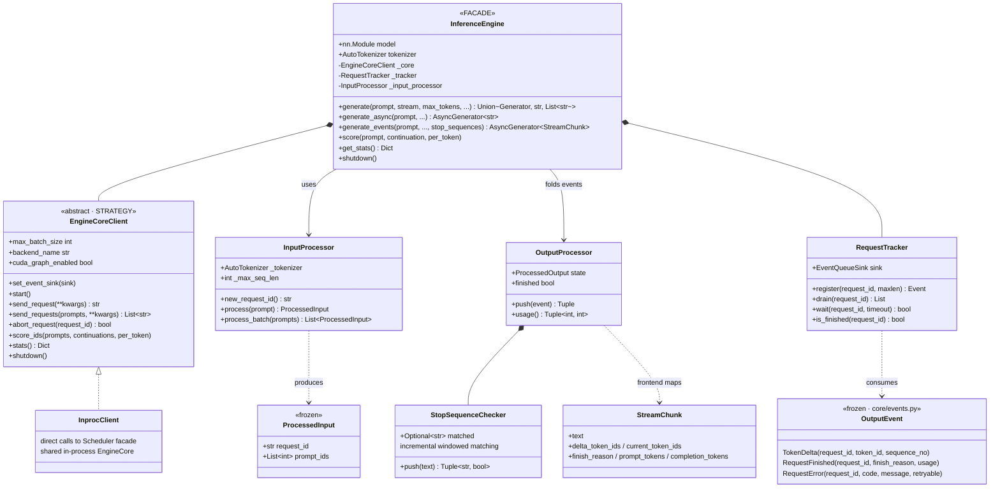

# Frontend Layer

`astrai/inference/frontend/` — everything that faces the user. The vLLM
analogue is the API process (`AsyncLLM` / `LLMEngine` +
`InputProcessor` / `OutputProcessor`); here it is an in-process layer so
colocated RL rollout keeps sharing the model object with the trainer.

Frontend code must not touch engine locks, hold `Request` objects beyond
submission, or read KV state.

## Classes

## Responsibilities

- **`InputProcessor`** tokenizes on the caller's thread (single or one
  batched `encode` call) and **mints the request id before submission**.
  Because the id exists before the scheduler knows about the request, an
  event can never precede its consumer — this is what allowed the old
  `_ResultSink` replay buffer to be deleted.
- **`OutputProcessor`** folds events for one request: incremental
  detokenization (via `StreamDecoder`), stop-sequence matching with a
  sliding window over the ambiguous tail (never a full-body substring
  scan), and exact usage accounting from token deltas (never re-encoding
  text to count tokens). Degrades to token-id-as-string when the
  tokenizer lacks the Rust streaming handle, so a stream always
  terminates.
- **EngineCoreClient** owns the frontend-to-core boundary for requests,
  scoring, status, event delivery and lifecycle. The engine accepts an
  injected client through the core_client constructor argument. The default
  InprocClient still calls the live Scheduler facade in the same process.
  Direct InferenceEngine.scheduler access warns in the first refactor release
  and remains available for one minor version.
- **`RequestTracker`** holds bounded per-request event queues for blocking
  consumers and supports async subscriptions for streaming consumers. A
  subscriber atomically takes the queued backlog and becomes the live route;
  the scheduler thread batches notifications per event loop and hands events
  to each stream's ``asyncio.Queue``. Detokenization and protocol formatting
  stay on the consumer loop, outside the sink lock. The sink flags the
  request's finished ``Event`` when it receives the terminal event, so
  completion is observable without a consumer folding the stream.

## Blocking generate is completion-driven

Non-streaming `generate` runs **no helper thread**. It submits, parks the
caller on the per-request finished events, and when every request has
terminated folds all events at once on the caller's thread
(`_collect_blocking`). Per-step fold wake-ups were a measured host
overhead: each wake is a GIL handoff with the scheduler loop at exactly
the worst time (between commit and the next submit). Folding once, after
the batch is done, moves the same work off the decode loop entirely; the
event queues for blocking generate are sized to `max_seq_len + 1` so
accumulating until completion never drops tokens. Streaming entry points
keep incremental folding — their consumers want text as it is produced.

## Error containment

The completion-driven fold is fault-tolerant: a per-request fold failure
keeps that request's partial text instead of losing the whole batch, and
a `RequestError` terminal event is logged and reported through the same
partial-text path rather than hanging the caller. The scheduler's
`_emit_events` catches sink exceptions — consumer failures never reach
the engine loop.

Text-stop completion is separate from core completion. An early text stop,
consumer exception or closed iterator aborts the unfinished core request;
a naturally delivered core terminal does not trigger a redundant abort.
The tracker marks terminal state before notifying a consumer and ignores
subsequent duplicate/late events. Single-character stop strings retain no
ambiguous suffix, while a natural terminal flushes the unmatched suffix.
Prompt usage is initialized from the already-tokenized input so an early
text stop still reports the correct prompt length.
