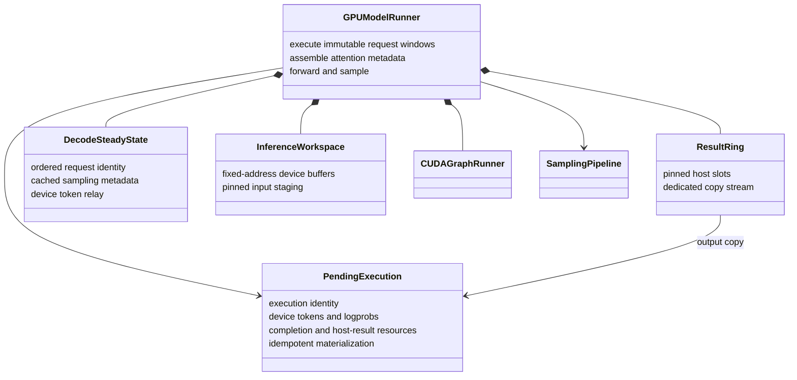

# Worker Layer

`astrai/inference/worker/` executes model work in-process. It owns input
assembly, device buffers, sampling, CUDA graphs and result materialization.
It does not own request lifecycle or retain core `Request` objects.

## Data boundary

The neutral `contracts.py` defines immutable execution-request descriptions,
`SchedulerOutput` and `ModelRunnerOutput`. A plan identifies its step, policy
version and request windows. It contains execution data, not a reference to a
live scheduler request. The returned results identify the requests to which
rows belong; the core must not infer that correspondence from a mutable batch.

The core applies results to requests. Worker-side result materialization does
not append output tokens, decide a request's final service state, emit terminal
events or release logical request KV allocations.

## Submit and materialize

AstrAI's submit/commit boundary separates **forward plus sampling submission**
from **host result materialization**. It is not the same split as vLLM's
`execute_model`/`sample_tokens`, which separates forward from sampling.

- Submission produces device-resident sampled tokens and optional raw-model
  logprobs without resolving their values on the host.
- `ResultRing` can post a nonblocking copy into pinned storage on a dedicated
  stream. The pending handle owns the associated result slot until it is
  materialized and released.
- Materialization waits for the copy when necessary and produces an immutable
  result with execution/request identity. It is safe to invoke defensively
  more than once; the core separately ensures exactly-once state application.
- An execution without a sampled token, such as an intermediate prefill
  chunk, still has a completion boundary. Its KV cannot be advertised as a
  reusable prefix before that boundary.

Every backend sub-batch needs its own accounted-for handle/result. A later
submission must not silently overwrite an earlier handle. Discarding an
output because of cancellation, EOS or version mismatch does not remove the
need to retire its copy, device and KV references safely.

## Preserved decode fast path

`DecodeSteadyState` identifies the ordered batch by request identity, not just
by physical request slots that may be reused. For an unchanged supported
batch, the previous sampled token fills the next input device-to-device.
Sampling metadata and fixed-address workspace are reused rather than rebuilt
from GPU predicates each step.

`SamplingPipeline` applies frequency penalties before temperature/top-k/top-p.
Raw-model logprobs are computed before those sampling transformations, preserving
the rollout contract. Frequency-history changes may require a drain or metadata
refresh; the zero-host-synchronization claim applies to the supported steady
CUDA decode path, not every fallback and sampling combination.

`CUDAGraphRunner` retains the pure-decode path. Graph inputs must live at stable
addresses owned by `InferenceWorkspace`, and capture must not race outstanding
work on those buffers. Sampling remains outside the captured forward. An
in-place weight update does not by itself change parameter addresses.
Each runner captures on an explicit stream bound to its input device. Async
rollout constructs replicas sequentially and freezes new captures before
generator threads start; an unseen batch size runs eager. PyTorch allows only
one capture at a time per process, and its implicit graph stream may produce
an empty graph on later GPUs in a single-process multi-GPU setup.

## Prefill and future mixed execution

Chunked prefill already supports bounded windows and suppresses sampling for
nonfinal chunks. Current calls use a shared start offset within a prefill
sub-batch. This is not yet a single globally budgeted mixed prefill/decode
forward.

The model/KV ABI already represents packed token inputs with query offsets,
KV lengths and slot mappings. A later mixed-forward stage can supply
per-request windows and sampling-row mappings while preserving the pure-decode
fast path. It should not require another directory migration or an immediate
replacement of the attention kernels, allocator or prefix index.
