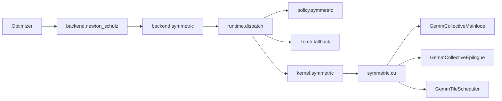

# Symmetric matrix operations

## Math contract

The public out operations are independent of optimizers:

```python
from astrai.extension import syrk_out, symm_out

# X: [m, k], C and out: [m, m]; C is fully symmetric.
syrk_out(X, out, alpha=alpha, beta=beta, addend=C)
# out = alpha * X @ X.T + beta * C

# S: [m, m], X, C and out: [m, n]; S is fully symmetric.
symm_out(S, X, out, alpha=alpha, beta=beta, addend=C)
# out = alpha * S @ X + beta * C
```

`addend` may be omitted when `beta=0`; it is then ignored. Operands share the
output dtype and device, and output storage must not overlap inputs. SYRK's
addend and SYMM's left operand must be symmetric in full storage. Symmetry
is a caller contract, avoiding a device reduction and host synchronization
on every launch. SYRK reads the lower triangular result and mirrors its
rounded values, producing bitwise equal halves. These out operations do
not support autograd.

Both operations also accept rank-3 tensors with a leading batch dimension.
Every matrix is independent: SYRK takes `[batch, m, k]` and produces
`[batch, m, m]`; SYMM takes `[batch, m, m]` and `[batch, m, n]`.
Operands and active addends must have the same batch size; there is no batch
broadcasting in the public contract.

Torch handles arbitrary valid matrix sizes, floating dtypes and layouts.
The optional CUDA path currently accepts dense row/column-major BF16 matrices with
positive matrix dimensions divisible by 64 and aligned input addresses.
A CUDA batch has 1 to 65535 matrices packed at constant matrix-size strides;
each matrix uses the common row- or column-major layout. Runtime
selection respects deterministic algorithms and BF16 reduction settings.
Explicit `backend="cuda"` rejects unsupported calls; ordinary dispatch
falls back to Torch. This is a restricted CUDA implementation of the two
BLAS-style formulas, not a complete BLAS interface with side/uplo/trans flags.

## Components and dispatch



The kernel adapter only forwards arguments. The backend owns validation,
operator registration and fallback. The policy owns measured decisions;
the optimizer has no tile, layout, hardware or model-size conditions.
`op_backend(syrk="torch", symm="torch")` forces Torch through the shared
operator registry. Explicit CUDA selection and the adapter allow candidate
measurement without using automatic planning.

SYRK has a triangular WMMA candidate and square candidates built from the
existing GEMM mainloop, pipeline and epilogue. The latter stage accumulators
through the shared epilogue before mirroring the lower triangle. SYMM uses
`(S X).T = X.T S`, the shared raster scheduler, mainloop and transposed
output epilogue. Both fuse the independent addend and coefficients into
FP32 accumulators before BF16 rounding. Batch launches reuse the existing
`GemmParams` batch strides and `grid.z`; matrices never share accumulators.

Tile candidates reuse the complete `TileManifest` from
`include/policy/manifest.cuh`. `kernel.symmetric.tiles(operation)` reports
CTA/warp dimensions, K depth, stages, thread count, shared memory and supported
input layouts. SYRK filters for square CTA geometry; its column-major
candidates also follow the GEMM crosswise K-depth constraint. The WMMA
candidate accepts row-major inputs. SYMM accepts dense row/column-major inputs
and outputs and the existing grouped raster orders. Candidate resources are
checked against the device before launch.

SYRK writes both off-diagonal tiles by consecutive output rows. The upper
tile reads the transpose from shared memory, keeping global writes contiguous.
The two triangles use independent bounds so partial edge tiles remain correct.

Plans are keyed by operation, compute capability, matrix dimensions,
active addend, input/output layouts and batch size (default 1). No parameter or model names participate.
Unknown geometries and batch sizes fall back to Torch. The initial measured table is
conservative; replace it with measurements for the current environment:

```python
import json
from astrai.extension.policy import symmetric as plan

plan.configure(json.loads(open("symmetric-plan.json").read()))
print(plan.probe("symm", X, output=out, addend=True))
# configure([]) disables automatic CUDA selection.
```

Builtin choices are cached by matrix metadata, alignment, runtime settings,
registry revision and measured-table revision. The cache owns callables rather
than tensors and is bounded. Changing a plan or restoring a scoped plan refreshes
selection. Context/process overrides and external implementations bypass this
cache, preserving per-call predicates. Device capability is cached separately;
reduction and deterministic settings remain part of each decision.

## Sweep

The sweep follows the GEMM tile benchmark: enumerate compiled recipes,
force each candidate, check numerics, then time Torch/CUDA in interleaved
ABBA order. Each Graph replay contains ten calls. Candidates with excessive
shared memory or unsupported input layouts are reported as skipped. Incorrect
results fail the sweep.
Only candidates beating Torch by the configured margin become CUDA plan rows.

```bash
python scripts/benchmark/symmetric.py --operation syrk --list
python scripts/benchmark/symmetric.py --operation syrk --batch-size 4 --plan-output batch-plan.json
python scripts/benchmark/symmetric.py --operation syrk \
    --shapes 1536:6912 --output syrk-measurements.json --plan-output syrk-plan.json
python scripts/benchmark/symmetric.py --operation symm --beta 3.4445 \
    --rasters 0,1,2,-1,-2 --output symm-measurements.json --plan-output symm-plan.json
python scripts/benchmark/symmetric.py --operation symm --beta 3.4445 \
    --input-layout row --output-layout column --plan-output layout-plan.json
```

Sweep files are measurement artifacts rather than checked-in benchmark data.
A faster individual kernel must also pass the complete recurrence benchmark
before selecting it for optimizer use.
