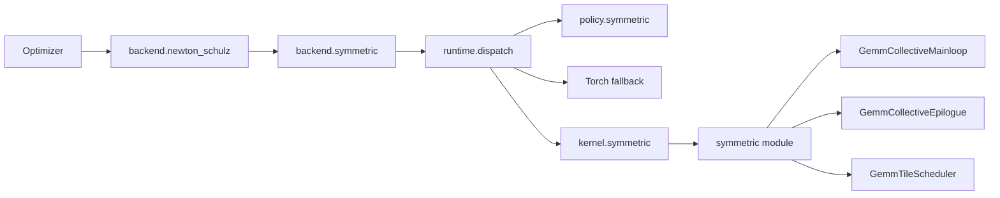

# Symmetric matrix operations

## Math contract

The public out operations are independent of optimizers:

```python
from astrai.extension import syrk_out, symm_out

# X: [m, k], C and out: [m, m]; C is fully symmetric.
syrk_out(X, out, alpha=alpha, beta=beta, addend=C)
# out = alpha * X @ X.T + beta * C

# S: [m, m], X, C and out: [m, n]; S is fully symmetric.
symm_out(S, X, out, alpha=alpha, beta=beta, addend=C)
# out = alpha * S @ X + beta * C
```

`addend` may be omitted when `beta=0`; it is then ignored. Operands share the
output dtype and device, and output storage must not overlap inputs. SYRK's
addend and SYMM's left operand must be symmetric in full storage. Symmetry
is a caller contract, avoiding a device reduction and host synchronization
on every launch. SYRK reads the lower triangular result and mirrors its
rounded values, producing bitwise equal halves. These out operations do
not support autograd.

Both operations also accept rank-3 tensors with a leading batch dimension.
Every matrix is independent: SYRK takes `[batch, m, k]` and produces
`[batch, m, m]`; SYMM takes `[batch, m, m]` and `[batch, m, n]`.
Operands and active addends must have the same batch size; there is no batch
broadcasting in the public contract.

Torch handles arbitrary valid matrix sizes, floating dtypes and layouts.
The optional CUDA path currently accepts dense row/column-major BF16 matrices with
positive matrix dimensions divisible by 64 and aligned input addresses.
A CUDA batch has 1 to 65535 matrices packed at constant matrix-size strides;
each matrix uses the common row- or column-major layout. Runtime
selection respects deterministic algorithms and BF16 reduction settings.
Explicit `backend="cuda"` rejects unsupported calls; ordinary dispatch
falls back to Torch. This is a restricted CUDA implementation of the two
BLAS-style formulas, not a complete BLAS interface with side/uplo/trans flags.

## Components and dispatch



The C++ module has three translation units: \`bindings.cu\` owns the pybind
surface, \`entry.cu\` validates tensors and packs GEMM parameters, and
\`kernels.cu\` owns the typed kernels, launch dispatch and their resource
planner. Their declarations are private to \`symmetric/entry.h\`.

The kernel adapter forwards execution arguments and exposes candidate and plan
metadata. The backend owns validation, operator registration and fallback. The
policy owns measured-first hybrid dispatch; the optimizer has no tile, layout
or shape-specific conditions.
`op_backend(syrk="torch", symm="torch")` forces Torch through the shared
operator registry. Explicit CUDA selection and the adapter allow candidate
measurement without using automatic planning.

SYRK has a triangular WMMA candidate and square candidates built from the
existing GEMM mainloop, pipeline and epilogue. The latter stage accumulators
through the shared epilogue before mirroring the lower triangle. SYMM uses
`(S X).T = X.T S`, the shared raster scheduler, mainloop and transposed
output epilogue. Both fuse the independent addend and coefficients into
FP32 accumulators before BF16 rounding. Batch launches reuse the existing
`GemmParams` batch strides and `grid.z`; matrices never share accumulators.

Tile candidates reuse the complete `TileManifest` from
`include/policy/manifest.cuh`. `kernel.symmetric.tiles(operation)` reports
CTA/warp dimensions, K depth, stages, thread count, shared memory and supported
input layouts. SYRK filters for square CTA geometry; its column-major
candidates also follow the GEMM crosswise K-depth constraint. The WMMA
candidate accepts row-major inputs. SYMM accepts dense row/column-major inputs
and outputs and the existing grouped raster orders. Candidate resources are
checked against the device before launch.

SYRK writes both off-diagonal tiles by consecutive output rows. The upper
tile reads the transpose from shared memory, keeping global writes contiguous.
The two triangles use independent bounds so partial edge tiles remain correct.

Plans are keyed by operation, compute capability, matrix dimensions,
active addend, input/output layouts and batch size (default 1). Default dispatch
first uses an exact measured row, including a row that selects Torch. An unlisted
legal BF16 shape or batch size uses the shared GEMM geometry planner. Unsupported
inputs, disabled runtime settings and geometries with no eligible compiled
candidate retain Torch. Planning performs no online benchmark and does not
claim that a heuristic CUDA choice is faster than Torch.

Replacing rows with `configure(rows)` defaults to table-only dispatch: missing
keys select Torch. Pass `heuristic=True` to retain geometry fallback. Calling
`configure()` reads the table without changing either mode;
`configure(heuristic=True)` changes only the fallback mode. Invalid rows leave
both settings intact. `override(rows)` is table-only by default, and restores
both the previous rows and fallback mode on exit, including after an exception.

```python
import json
from astrai.extension.policy import symmetric as policy

with open("symmetric-plan.json") as file:
    rows = json.load(file)
policy.configure(rows, heuristic=True)  # measured rows, then geometry fallback
print(policy.probe("symm", X, output=out, addend=True))

with policy.override(rows):  # temporarily use only these measured rows
    symm_out(S, X, out)
# The prior measured table and heuristic setting are restored here.
# policy.configure([]) disables automatic CUDA selection.
```

Builtin choices are cached by matrix metadata, alignment, runtime settings,
registry revision and policy revision. The cache owns callables rather than
tensors and is bounded. Changing rows or the fallback mode, or restoring a
scoped plan, refreshes selection. Context/process overrides and external
implementations bypass this cache, preserving per-call predicates. Device
capability is cached separately; reduction and deterministic settings remain
part of each decision.

## Geometry planning

Symmetric operations reuse `geometry_cost` and `geometry_raster` from
`include/launcher/gemm_cost.h`. The cost ranks five relative work proxies in
log space; lower scores are preferred:

| Proxy | Work represented |
| --- | --- |
| Memory | Operand copies and epilogue reads/writes over scheduling waves. |
| Aggregate MMA | Matrix instructions across resident CTAs and warps. |
| Per-warp work | MMA, shared-memory fragment loads and dtype conversions. |
| Aggregate fragment work | Fragment loads and conversions across CTAs and warps. |
| Pipeline overhead | Barrier participation and copy issue work. |

Tile dimensions, K depth, stages, warp count, batch size and the grid determine
these proxies. The planner queries the actual layout-specific symmetric kernel
through the shared `kernel_resources` helper. CUDA occupancy accounts for its
thread count, shared-memory allocation and compiler-reported registers;
register and local-memory counts are also exposed for inspection. Resource
metadata is cached per typed kernel and device. It is queried without launching
or timing a candidate. Scores are relative ranking values, not absolute time
predictions or a comparison against Torch latency. The geometry planner ranks
eligible shared-GEMM candidates; the separate WMMA candidate remains available
for explicit calls and measured rows.

SYRK uses a triangular grid. For a square tile of width `t`, let
`H = ceil(m / t)`, `G = H * (H + 1) / 2`, and `h_i` be each tile row's valid
height, including the final partial row. A batch of size `B` launches `B * G`
CTAs. Diagonal CTAs still perform a complete tile MMA; the per-CTA computation
is not halved. With output element size `e`, average epilogue traffic per CTA is:

- Writes: `e * m^2 / G`, covering the complete mirrored output.
- Active addend reads: `e * (m^2 + sum(h_i^2)) / (2 * G)`, covering lower
  off-diagonal tiles and complete valid diagonal tiles.

SYMM prices its transposed GEMM geometry: `M = n`, `N = m`, `K = m` for an
input `[m, n]`. For `Q = ceil(n / block_m) * ceil(m / block_n)`, it launches
`B * Q` CTAs. Average epilogue traffic is
`e * m * n * (1 + active_addend) / Q`. These expressions count valid edge
cells rather than padded tile areas. Batch size increases the grid and changes
occupancy waves; it does not multiply the average bytes per CTA. Input/output
layouts select their actual kernel variant and resource usage, while SYMM
uses the shared raster heuristic.

`kernel.symmetric.plan` inspects this geometry decision from integer metadata;
it does not consult measured rows. It returns the selected tile/raster and
ranked candidates, with `score`, `blocks`, `resident_ctas`, `registers`,
`local_bytes` and `shared_memory`. An empty dictionary means no recipe is
eligible. Returned dictionaries are independent copies of cached metadata.
For automatic dispatch including measured rows, use `policy.probe` instead.

```python
from astrai.extension.kernel import symmetric as kernel

metadata = kernel.plan(
    "symm", rows=ROWS, cols=COLS, batch_size=BATCH_SIZE,
    input_layout="row", output_layout="column", addend=True,
    device=DEVICE_INDEX,
)
print(metadata.get("tile"), metadata.get("candidates", []))
```

The uppercase values are integer dimensions and a device index from the caller's
configuration. Populate dispatch and resource caches before CUDA Graph capture.

## Sweep

The sweep follows the GEMM tile benchmark: enumerate compiled recipes,
force each candidate, check numerics, then time Torch/CUDA in interleaved
ABBA order. Each Graph replay contains ten calls. Candidates with excessive
shared memory or unsupported input layouts are reported as skipped. Incorrect
results fail the sweep.
Only candidates beating Torch by the configured margin become CUDA plan rows.
The report also marks the geometry-selected candidate and records its paired
measurement, so a relative score can be checked against observed timings.

```bash
python scripts/benchmark/symmetric.py --operation syrk --list
python scripts/benchmark/symmetric.py --operation syrk \
    --shapes <rows>:<cols> --batch-size <batch-size> \
    --output <measurements-json> --plan-output <plan-json>
python scripts/benchmark/symmetric.py --operation symm --beta <beta> \
    --shapes <rows>:<cols> --rasters 0,1,2,-1,-2 \
    --output <measurements-json> --plan-output <plan-json>
python scripts/benchmark/symmetric.py --operation symm --beta <beta> \
    --shapes <rows>:<cols> --input-layout row --output-layout column \
    --plan-output <plan-json>
```

Replace angle-bracket placeholders before running these commands. Sweep files
are measurement artifacts rather than checked-in benchmark data.
A faster individual kernel must also pass the complete recurrence benchmark
before selecting it for optimizer use.
