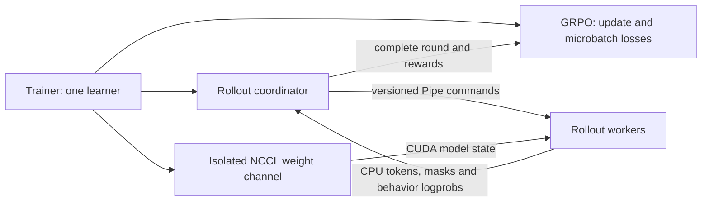

# Trainer internals

For configuration and usage, start with [Training](../../guides/training.md)
and [Distributed training](../../guides/distributed.md). This page describes
where the implementation lives and which module owns each responsibility.

## Layout

```text
astrai/trainer/
  trainer.py             training loop and callback lifecycle
  train_context.py       context, checkpoint/model setup, datasets and assembly
  callbacks/
    base.py              callback protocol and registry
    checkpoint.py        checkpoint persistence
    metrics.py           metric logging and validation
    metric_util.py       metric accessors and gradient SNR tracking
    optimization.py      gradient clipping and activation checkpointing
    progress.py          progress bar
  strategy/
    base.py              common objective lifecycle and loss protocol
    factory.py           strategy registry
    ops.py               shared loss and tensor operations
    supervised.py        sequence and SFT objectives
    dpo.py               DPO objective
    grpo.py              GRPO objective
    ppo.py               PPO objective
  rollout/
    types.py             rollout results and sampling contracts
    generator.py         inference-backed generation
    runner.py            reward scoring, replay cache and evaluation
    setup.py             rollout assembly
    async_round.py       round scheduling, reply validation and prefetch
    worker.py            one frozen inference replica per spawned process
    protocol.py          versioned control messages and reply envelopes
    nccl_transport.py    isolated learner-to-replica weight broadcasts
    batching.py          prompt partitioning and ordered result assembly
  backend.py             colocated and replica rollout backends
  schedule.py            learning-rate schedules
  optional_extras.py     checkpointed component state registry
```

## Ownership

- Trainer owns the epoch/batch loop and invokes callback lifecycle hooks.
- TrainContextBuilder assembles model, optimizer, scheduler, datasets,
  strategy, parallel topology and online rollout. Keep construction order here.
- Each strategy owns its algorithm-specific loss and state. Shared objective
  operations belong in strategy/ops.py.
- Rollout modules own generation and reward evaluation. backend.py owns
  where generation runs and how policy weights reach that backend.
- Callbacks own checkpoint writing, progress display, metric logging and
  validation. Metric helpers live alongside them in callbacks/metric_util.py.

## Import surfaces

Use package exports for supported imports:

- astrai.trainer: Trainer, strategy/scheduler factories, callback protocol
  and registry.
- astrai.trainer.callbacks: built-in callback classes.
- astrai.trainer.strategy: built-in objectives and shared strategy API.
- astrai.trainer.rollout: rollout types, generator, runner and evaluator.

There is no astrai.trainer.train_callback compatibility module; import
callbacks from astrai.trainer.callbacks. The implementation files may change
as responsibilities evolve, so prefer these package-level imports unless
working directly on an implementation.

## Asynchronous multi-GPU GRPO

The current `async_round` mode has one CUDA learner and one spawned process
per configured rollout device. The learner owns the trainable actor, optimizer,
learning-rate scheduler, frozen KL reference and checkpoints. Each worker owns
its frozen actor, inference backend, CUDA Graph and KV cache. A worker's
inference engine remains in the same process as that worker's model; the
colocated backend still shares the learner model in its existing process.



### Ownership and version boundaries

- Trainer uses the same batch/update loop for synchronous and asynchronous
  strategies. It commits the optimizer, scheduler and checkpoint counters.
- GRPO weights complete prompt microbatches by their valid-token or nonempty
  response counts. One collected round produces one optimizer update.
- The coordinator partitions prompts, preserves response order, scores rewards
  and validates request ID, round ID and policy version before yielding a round.
  It owns at most one pending generation round; partial results never reach
  the learner.
- The Pipe carries control messages and CPU rollout results. KV cache and full
  logits stay on each worker. NCCL carries model state through a standalone
  process group; workers are not training or checkpoint ranks.

Round zero uses the initial actor. Before training a collected round, the
coordinator submits the following round under the current actor version.
Generation therefore overlaps the learner update with a maximum lag of one
optimizer version. After collection, the next submission synchronizes the
latest weights. Every worker joins each broadcast, including workers with no
prompts in a short final round; an ACK is sent only after CUDA completion.

A failed or stale collection performs no learner update. An optimizer update
that advanced the policy version remains a committed step even if later
publication fails. Resume restores the completed sample cursor and version,
rebuilds worker replicas, and discards pending prefetched results. Normal
shutdown sends STOP and enters NCCL shutdown on the learner before joining
workers; failure cleanup aborts the channel and terminates remaining workers.

### Capacity and extension boundary

This mode is local, opt-in, dense online GRPO with one learner, one update per
round, and no validation backend. Add workers only while generation remains
slower than learner computation; extra replicas do not accelerate the learner.

Synchronous online training already accepts DDP with replicated inference
views. Extending this asynchronous coordinator to several learners is a
separate topology change. It must use the actual training reducer group for
global GRPO normalization, keep complete prompt groups within
update windows, and coordinate checkpoint cursors across learner ranks. FSDP
also needs a qualified actor-loading/reference-memory path and a full-policy
publication protocol for sharded state. The rollout-only NCCL group must stay
separate from those training groups. Merely removing the single-learner
configuration gate would not supply these guarantees.

### Parameter resolution and reproducible sampling

`TrainConfig` rejects unknown fields. The common training parameters
`rl_update_epochs`, `rl_minibatch_prompts`, `gradient_chunked_logprobs` and
`moe_aux_loss_coef` belong on `TrainConfig`; putting them in `strategy_kwargs`
is an error. The strategy owns its resolved `group_size` (GRPO defaults to 4,
requires at least 2 online), and rollout uses that same value.

Before loading models, the builder checks the actual distributed world size:
`async_round` requires one learner even under torchrun. Rollout setup resolves
devices, sampling, capacities, timeouts and the committed sample cursor into
an immutable `ResolvedAsyncRolloutConfig` in `rollout/setup.py`. All CUDA indexes
are logical indexes
after `CUDA_VISIBLE_DEVICES`; worker devices must be distinct and exclude the
learner. Startup logs include device assignments, GPU UUIDs, effective sampling,
seed/cursor and the three independent deadlines:

- `rollout_startup_timeout_s`: startup, default 300 seconds.
- `rollout_worker_timeout_s`: generation, default 600 seconds.
- `rollout_weight_timeout_s`: NCCL broadcast and ACK, default 600 seconds.

Each generated response receives a seed derived from `random_seed`, its global
prompt cursor and its response index. Request execution derives a stateless
per-token stream from that seed and token position. Sampling therefore does not
consume the worker's global RNG and is independent of worker assignment,
request order and batch compaction. A stale retry reuses its seeds; resume derives
new requests from the committed cursor, discarding prefetched results as before.
Identical weights and logits are required for token equality. Resume can load a
newer policy than an abandoned prefetched round, and different numerical kernels
can produce different logits; request seed equality alone cannot remove those
differences.
