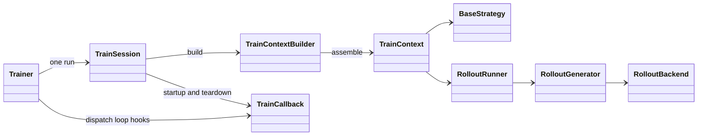

# Trainer internals

Trainer has four cooperating parts: a run loop, a constructed context,
an objective strategy, and optional rollout. Callbacks observe lifecycle
events and own persistence or presentation. This folder follows the same
subsystem-level layout as the [inference internals](../inference/README.md).

```text
astrai/trainer/
  trainer.py, session.py, train_context.py   loop, lifetime, construction
  strategy/                                  objectives and loss contracts
  rollout/, backend.py                       generation and reward path
  callbacks/, optional_extras.py             hooks and checkpoint extras
  schedule.py                                 learning-rate policies
```

The dependency direction is Trainer -> TrainSession -> TrainContextBuilder ->
strategy and rollout. Rollout generation depends on a backend; objectives
consume scored rollout results. Callbacks receive TrainContext after an event
rather than owning the optimizer loop.

## Documents

| Document | Scope |
| --- | --- |
| [lifecycle.md](lifecycle.md) | Trainer, session, context, configuration and scheduler |
| [strategy.md](strategy.md) | Strategy protocol, registration, capabilities and objectives |
| [rollout.md](rollout.md) | Backend, generation, scoring, worker protocol and weight transport |
| [async_round.md](async_round.md) | One-learner asynchronous GRPO execution and failure boundaries |
| [callbacks.md](callbacks.md) | Hook order, checkpoint state, metrics and optimization hooks |

## Ownership



Trainer owns optimizer commits and counters. TrainContextBuilder owns creation
and checkpoint restore; TrainSession owns startup and cleanup after construction.
A strategy owns its objective, not the run lifecycle. A rollout backend owns
where inference executes and how policy weights arrive.

The package exports Trainer, factories and protocols from astrai.trainer.
Built-in callbacks, strategies and rollout contracts have their own package
exports. TrainConfig resolves the strategy registry inside its validators:
importing it at module load time would pull inference into a partially
initialized model package. Other runtime trainer imports remain at module
scope; type-only imports use TYPE_CHECKING.

For configuration and usage, see the [training guide](../../guides/training.md)
and [distributed training guide](../../guides/distributed.md).
