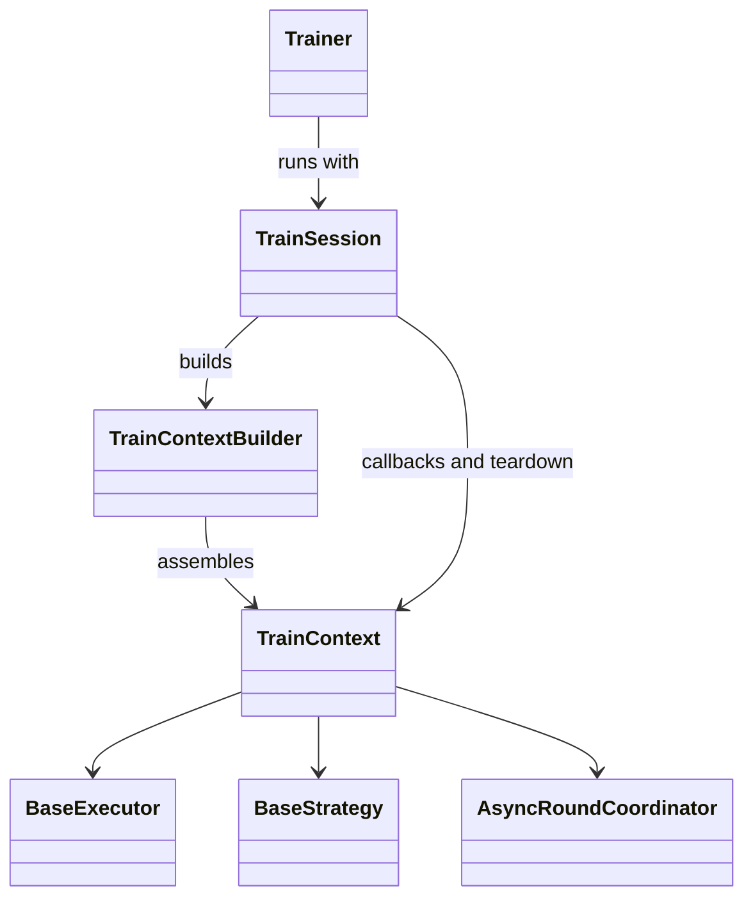

# Run lifecycle and construction

The run loop is in trainer.py, startup and cleanup in session.py, and object
assembly in train_context.py. TrainConfig remains the public configuration.
schedule.py supplies registered learning-rate policies.

## Source modules

| Module | Responsibility |
| --- | --- |
| trainer.py | Epoch/batch loop, gradient accumulation, optimizer and scheduler commits, loop callbacks |
| session.py | Signal handlers, startup callbacks, error and end callbacks, rollout closure, final barrier |
| train_context.py | Context state, topology, model and data preparation, strategy and rollout assembly, checkpoint restore |
| schedule.py | Cosine, SGDR and WSD learning-rate implementations and scheduler registry |

## Loop and lifetime

TrainSession is an internal context manager for one run of Trainer.train().
It keeps the epoch/batch algorithm in Trainer and gives startup and teardown
one owner. TrainContextBuilder has a separate construction boundary because
TrainSession cannot clean up a context that build() has not returned.

The builder resolves topology and persisted state, creates the executor and
context, then prepares the model, optimizer, datasets, strategy and rollout.
After a context exists, a failed build closes its assigned async rollout and
re-raises the original error. AsyncRoundCoordinator also closes workers and
its weight channel if its own constructor fails before assignment.

On a successful build, the session registers signal handlers and calls
on_train_begin. The training loop then sets model.train(), walks epochs and
batches, and calls the normal batch/optimizer callbacks. A stop request calls
on_error to allow an emergency checkpoint before leaving the loop.

| Exit point | Cleanup and callback behavior |
| --- | --- |
| Build fails before returning a context | Builder closes any assigned async rollout. Session callbacks and signal registration have not started. |
| Signal registration or on_train_begin fails | Session calls on_error, closes rollout, calls on_train_end and unregisters signal handlers. The startup error is re-raised. |
| Epoch or batch loop raises | Session calls on_error, closes rollout, calls on_train_end and unregisters signal handlers. It skips the final distributed barrier and re-raises the loop error. |
| Normal completion or requested stop | Session closes rollout, calls on_train_end, attempts the distributed barrier when initialized, then restores the prior signal handlers. A requested stop already called on_error in Trainer. |

Each cleanup action is attempted even if an earlier one fails. A cleanup
failure is logged without replacing an existing startup or loop exception.
With no earlier exception, the first cleanup failure is raised after the
remaining actions. Signal registration preserves the previous SIGTERM and
SIGINT handlers and restores them on exit. TrainSession is internal; callers
continue to use Trainer.train().

## Context and checkpoint settings

TrainContext is the mutable state shared by Trainer, strategies, callbacks,
and rollout. It records the model, optimizer, scheduler, executor, data
loaders, step counters and stop request. TrainContextBuilder constructs those
objects in dependency order, restores checkpoint state, and closes an
assigned asynchronous rollout if construction fails.

create_ref_model() creates the frozen reference policy for strategies that
declare that capability. The builder uses StrategyCapabilities for auxiliary
models and calls rollout/setup.py for online execution. A completed context
is handed to TrainSession for lifecycle management.

TrainConfig keeps its public fields. TrainContextBuilder captures its callable
factories, datasets and collate function in _TrainRuntimeDependencies for
construction. TrainConfig.to_dict() builds a _CheckpointSettingsSnapshot by
reading fields individually and retaining JSON-compatible values. It does
not deep-copy Dataset or other runtime objects. None-valued fields that were
present in the old metadata remain present, and checkpoint keys remain
compatible with existing checkpoints.

Checkpoint restore still belongs to TrainContextBuilder. The builder loads
model state before strategy and rollout setup, restores optimizer/scheduler
state, and then restores optional reference or critic extras. Callbacks write
the settings snapshot through context.config.to_dict(); they do not serialize
runtime dependencies.

Trainer advances the scheduler only on committed optimizer updates.
