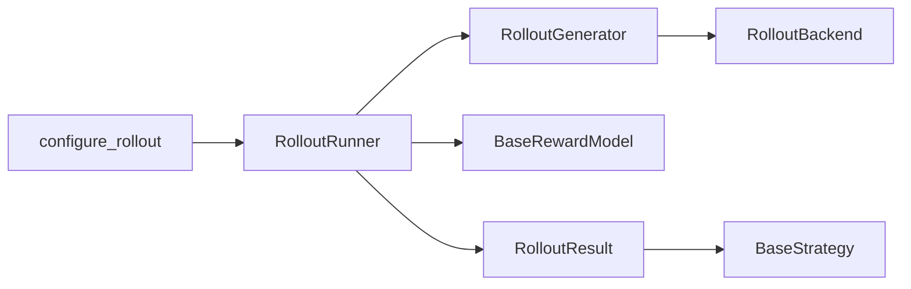

# Rollout path

Rollout turns prompts into scored, versioned results for online objectives.
The backend chooses execution placement; generator formats and decodes;
runner scores and validates; the strategy consumes the result.

## Source modules

| Module | Responsibility |
| --- | --- |
| backend.py | Colocated or frozen replica execution and policy-version updates |
| rollout/types.py | RawRollout, RolloutResult, SamplingParams and reward-model contract |
| rollout/generator.py | Prompt preparation, grouped generation and decoding |
| rollout/runner.py | Reward scoring, policy-version checks, replay cache and evaluation |
| rollout/setup.py | Backend assembly and resolved async device/sampling settings |
| rollout/batching.py | Prompt slicing and ordered worker-result merge |
| rollout/async_round.py | Round scheduling, reply validation and prefetch |
| rollout/worker.py | Spawned frozen inference replica and request execution |
| rollout/protocol.py | Versioned Pipe messages and result envelopes |
| rollout/nccl_transport.py | Separate learner-to-worker weight broadcasts and ACKs |

## Placement and version boundary

ColocatedBackend shares the learner model; ReplicaBackend owns a frozen copy.
Both implement RolloutBackend so RolloutGenerator does not know where inference
runs. The policy snapshot boundary prevents generation from observing a
partially published update. RolloutRunner rejects stale versions before a
scored result reaches the learner.

AsyncRoundCoordinator distributes prompts, merges results in input order and
checks request, round and policy identities. Worker processes keep their own
KV cache and CUDA Graph. The Pipe carries control and CPU results; a separate
NCCL group transports CUDA model weights. For startup, overlap, failure and
resume details, see [async_round.md](async_round.md).
